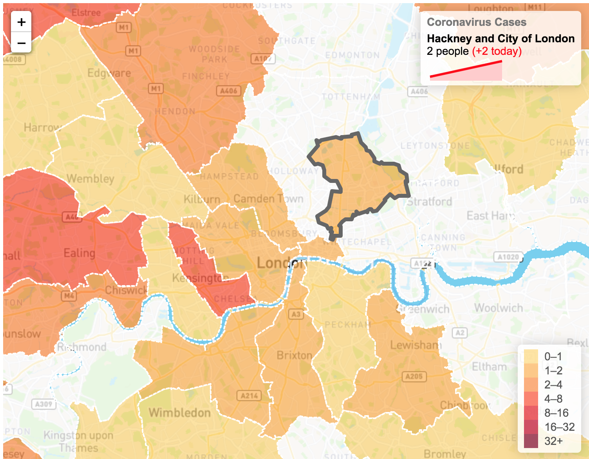

# Covid-19 London Tracker

Public Health England is publishing [daily regional breakdowns](https://www.gov.uk/government/publications/coronavirus-covid-19-number-of-cases-in-england/coronavirus-covid-19-number-of-cases-in-england) of the number of coronavirus cases in England. This project aims to visualize this data in a way that helps Londoners stay up to date about the spread of the virus in their communities.

